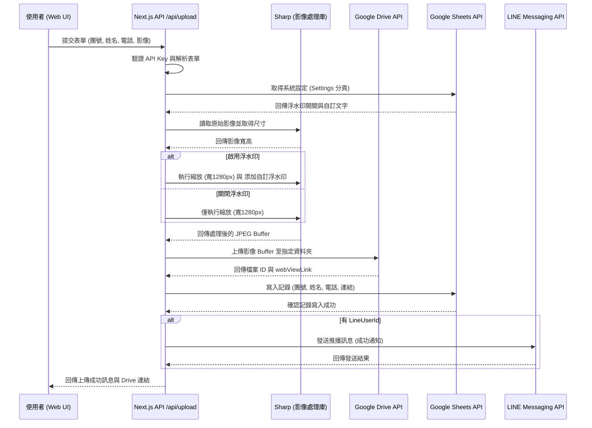

# 系統開發規格書 (SDS) - 旅遊證件上傳系統

## 1. 系統概述
本系統旨在提供一個安全、簡便的介面，供旅客上傳其旅遊證件（如護照）影像。系統會自動對影像進行處理（縮放及添加浮水印），並將其儲存於 Google Drive 之指定資料夾，同時將相關資訊記錄於 Google Sheets。

## 2. 功能需求
- **證件上傳**：使用者可以輸入團號、姓名、電話，並選取一張證件影像進行上傳。
- **影像處理**：系統會自動調整影像寬度為 1280px，並依照管理後台之設定決定是否添加浮水印及其文字內容。
- **浮水印自訂化**：管理員可於後台開啟/關閉浮水印功能，並自行輸入浮水印內容（文字後方會自動附帶當前日期）。
- **雲端儲存**：處理後的影像將上傳至 Google Drive 專屬資料夾，檔名依「團號_姓名_電話_時間戳.jpg」格式命名。
- **資料紀錄**：上傳完成後，系統會自動在 Google Sheets 中新增一筆記錄，包含團號、姓名、電話及檔案連結。
- **通知機制**：若使用者提供了 LINE User ID，系統在處理成功後會發送 LINE 推播訊息告知。

## 3. 技術架構
- **開發框架**：Next.js
- **影像處理**：Sharp
- **儲存服務**：Google Drive API v3
- **資料庫/紀錄**：Google Sheets API v4
- **通訊服務**：LINE Messaging API
- **驗證機制**：簡易 API Key (x-api-key) 防濫用

## 4. 流程循序圖 (Sequence Diagram)

## 5. 檔案結構 (核心組件)
- `pages/index.js`：使用者端上傳介面。
- `pages/api/upload.js`：核心上傳處理邏輯（包含影像處理、Drive/Sheet 串接）。
- `lib/googleSheets.js`：封裝 Google Sheets 操作邏輯。
- `google_api_setup_guide.md`：環境變數與 API 設定指南。

## 6. 重要開發考量 (Important Considerations)
> [!IMPORTANT]
> - **浮水印自訂化**：目前浮水印文字固定為「僅供 XX 旅遊辦理簽證使用」，若需針對不同客戶或用途調整，建議未來將此文字改為從環境變數或資料庫讀取。
> - **隱私與合規性**：雲端儲存檔名包含姓名與電話，便於管理但涉及敏感資訊。建議確保 Google Drive 資料夾權限僅限授權人員存取。

## 7. 驗證計畫 (Verification Plan)
### 自動化測試建議
- **API 測試**：使用 `curl` 或 `Postman` 模擬帶有 `x-api-key` 的 POST 請求，驗證回傳值與 Google Drive/Sheets 的同步狀態。
- **影像處理驗證**：檢查從 Google Drive 下載的影像是否確實包含浮水印且解析度符合預期 (1280px 寬)。

### 手動驗證步驟
1. 開啟 Web 介面並填寫測試資料。
2. 上傳一張測試圖片。
3. 確認頁面導向成功訊息，並檢查 LINE 是否收到通知。
4. 到 Google Drive 與 Google Sheets 確認檔案與記錄是否存在且內容正確。

---
*文件更新日期：2026-03-19*
